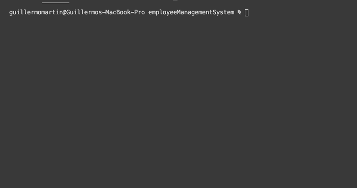
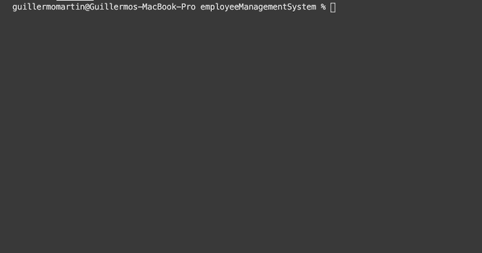

# Employee Management System

## Description
The following application is a command-line application that prompts a user with a series of choices.  These choices allow a user to add, view, update, and delete
departments, roles, and employees.  In order to use this application, a user would navigate to the root directory and type the following command in the terminal:

```sh
node server.js
```

The user will then be prompted with a list of choices.  Depending on the choice, the user will be prompted with a series of questions asking what they would like to do.  After answering all of the questions, the application will respond by updating the employee database.

## Technologies
This application uses the following: Node.js, Inquirer, mySQL, mySQL Workbench, and ESLint.

## Experiences
I thought this homework was very challenging. One of the challenges I faced was joining the columns together to form one table and how to effectively use data obtained when making a query.  When working on the homework I learned a lot.  I started to better understand the relationship between the database and Node.  I also learned how to utilize data obtained from queries effectively.


## Sample Functionality

#### Add and View Departments
  

#### Add and View Roles
  

#### Add and View Employee
  

#### Update Employee
 
